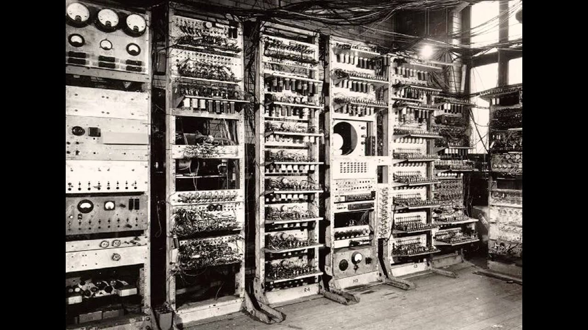

# TS-image-lambda

## How it works!:
The way this application works by uploading an image to one of my source S3 Bucket on AWS, at which point my Lambda trigger is activated and sends the photo through my lambda function to be resized by sharp, from there the functions job is then to upload it to my destination S3 ("sourceBucket-resized") where it can be downloaded in its new format.

## Issues:
Primary issues with this assigment came from working with unfamiliar AWS commands in the console, and getting used to Amazon's naming scheme and placement of things like permissions and roles.

## Original Image:

## Resized Image:
